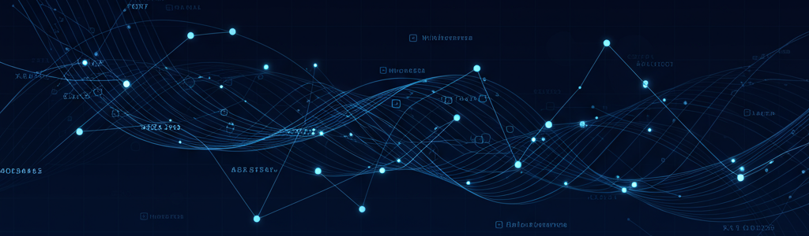

# 📈 Deep Learning for Time Series Demand Forecasting

[](https://www.python.org/downloads/) [](https://unit8co.github.io/darts/) [](https://pytorch-lightning.readthedocs.io/en/stable/) [](https://optuna.org/) [](https://code.visualstudio.com/docs/devcontainers/containers) [](https://www.tensorflow.org/tensorboard) [](https://plotly.com/python/)


## 📖 Overview
This project presents a deep-learning solution for demand forecasting. Originally developed for a consumer goods company, the system transformed a low-accuracy manual forecasting process into an automated pipeline that handles multiple data sources for a large and evolving product portfolio. 


### Business Objectives and Context
The primary objective was to improve short-term forecast accuracy for monthly supply chain planning, thereby minimizing stock-outs, optimizing resource allocation, and improving customer satisfaction. Key design drivers included:
- **Dynamic product portfolio:** Frequent product introductions and discontinuations necessitated a flexible solution that could adapt to this changes without constant retraining.
- **Multiple data sources:** The system needed to effectively integrate historical sales, product attributes, market indicators, and promotions into a unified forecasting model to enhance accuracy.
- **Operational scalability:** Limited computational resources and tight planning deadlines required balancing forecast accuracy with processing efficiency.


## 🛠️ Technical Highlights & Core Architecture

This solution features a modular, configuration-driven architecture in Python. Each model's configuration script defines parameters and utilizes a unified pipeline for training, hyperparameter optimization, and backtesting. 

The tech stack combines Darts for its time-series API, PyTorch Lightning as the deep learning engine, and Optuna for Bayesian hyperparameter optimization. Reproducibility is ensured via VS Code Dev Containers, with tracking through TensorBoard and the Optuna Dashboard.

🔗 For a detailed code walkthrough and results, explore [NBViewer: 1.0_DL_Time_Series_Overview.ipynb](https://nbviewer.org/github/D-Rubinich/deep-time-series-forecasting/blob/main/reports/1.0_DL_Time_Series_Overview.ipynb) 


### Key Architectural Components

* **Global Deep Learning Models:** A single model (TiDE, TFT, TSMixer, RNN variants) is trained across all products. Training is optimized with AdamW, OneCycle LR scheduling, gradient clipping, and early stopping. Performance is benchmarked against ARIMA, Exponential Smoothing, and Prophet.

* **Flexible Data Pipeline:**  Handles univariate and multivariate configurations with static, past, and future covariates in Darts `TimeSeries` format.

* **Robust backtesting:** Implements a custom monthly expanding window backtest with quarterly retraining and proper temporal splits to prevent data leakage.

* **Hyperparameter Optimization:** Systematically identifies optimal model architectures via Bayesian optimization before backtesting.

* **Business-Aligned Metrics:** Employs Weighted Absolute Percentage Error (WAPE) as the primary metric, prioritizing high-volume products, with Mean Absolute Percentage Error (MAPE) for product-level insight.

**Design Rationale:**
The global univariate approach best addresses our business needs, effectively capturing cross-product demand patterns while maintaining flexibility for portfolio changes. Multivariate models, by contrast, need strict temporal alignment between products time series and constant retraining as the catalog evolves.

## 🚀 Quick Start
This project runs inside a VS Code Dev Container built on a PyTorch base image. All dependencies, including CUDA, PyTorch Lightning, and system libraries, are pre-configured in Docker to ensure environment consistency. 

**Prerequisites**
- **WSL2** installed (Windows only) - [installation guide](https://learn.microsoft.com/windows/wsl/install)     
- **GPU** with **CUDA 12.4 / cuDNN 9** capability
    - Host driver ≥ 550.54 (Linux) or ≥ 551.61 (Windows) – see the [CUDA-driver compatibility table](https://docs.nvidia.com/cuda/cuda-toolkit-release-notes/index.html#cuda-compat-table)  
    - All CUDA and cuDNN libraries are bundled in the docker image, only the host driver must be installed on your system.
- **Docker Desktop** [download](https://www.docker.com/products/docker-desktop/)
    - Windows: enable the **WSL 2 backend** → *Settings › General › “Use WSL 2 based engine”*  *(GPU access requires WSL2)*
    - Native Linux (or Docker engine inside WSL 2): install **NVIDIA Container Toolkit** (`nvidia-docker2`) for GPU passthrough  
- **VS Code** with [Dev Containers extension](https://marketplace.visualstudio.com/items?itemName=ms-vscode-remote.remote-containers)


**Setup**
1. Clone & open in VS Code
```bash
git clone https://github.com/D-Rubinich/deep-time-series-forecasting.git
code deep-time-series-forecasting
```
2. Build and open in Dev Container:
   - If prompted, click "Reopen in Container"
   - If not prompted, open the Command Palette (Ctrl/Cmd + Shift + P) and select "Dev Containers: Rebuild and Reopen in Container"

3. Run the main notebook in the `reports` folder or any of the scripts in the `src` directory.

*Note: This setup is not easily reproduced with pip or conda due to specific GPU compatibility requirements with PyTorch and CUDA, so running this project with Docker is strongly recommended.*

## 🎯 Project Status & Roadmap

**Current Release (v1.0)** ✅
- Core forecasting pipeline for different deep learning architectures and local models
- Automated hyperparameter optimization with Optuna
- Custom expanding-window backtesting framework

**Upcoming Features (v2.0)** 🚧
- Full end-to-end pipeline with automated backtest, model selection and monthly forecasts
- Interactive dashboard for forecast visualization and KPI monitoring
- New model architectures, including ensemble/stacking strategies and probabilistic forecasts


## 📁 Project Structure
```
├── README.md                               <- Main project documentation
├── LICENSE                                 <- Custom license for educational use
├── .gitignore                              <- Git ignore rules
├── requirements.txt                        <- Python package requirements
├── setup_paths.py                          <- Path configuration setup (runs on container build)
├── config.py                               <- Global configuration settings
├── .env.example                            <- Environment variables template
│
├── .devcontainer/                          <- VS Code Dev Container files (Docker-based setup)
│
├── data/                                   <- Data storage directory
│   ├── backtest_results/                   <- Model backtesting outputs
│   ├── optuna/                             <- Optuna study database (e.g., study.db) 
│   ├── interim/                            <- Intermediate processed data 
│   ├── processed/                          <- Final datasets for modeling (synthetic dataset)     
│   └── raw/                                <- Raw input files
│
├── logs/                                   <- Log files for debugging and tracking 
│   ├── backtest_logs/                      <- Per-model backtest logs
│   ├── errors/                             <- Error and exception logs
│   └── tensorboard_logs/                   <- TensorBoard training logs
│
├── reports/                                <- Reports, visuals, and notebooks
│   ├── images/                             <- Graphics and figures
│   └── 1.0_DL_Time_Series_Overview.ipynb   <- Full project walkthrough notebook  
│
└── src/                                    <- Source code for the project
    ├── backtest/                           <- Model-specific backtest entry points
    ├── pipelines/                          <- Data, backtest, and Optuna logic
    ├── utilities/                          <- Logging, evaluation and parameter setup helper functions 
    └── viz/                                <- Visualization and reporting utilities

```

## 📄License
This project is for educational and portfolio demonstration purposes. Commercial use is prohibited without permission. See [LICENSE](./LICENSE) file for details.

## 📚 References
**Forecasting Libraries and Tools**
- [Darts documentation](https://unit8co.github.io/darts/index.html) - Darts: Time series forecasting library 
- [Darts GitHub](https://github.com/unit8co/darts) - Darts source code and examples
- [PyTorch lightning documentation](https://lightning.ai/docs) - Deep learning framework for model training
- [Optuna documentation](https://optuna.readthedocs.io/en/stable/) - Hyperparameter optimization framework
- [TensorBoard documentation](https://www.tensorflow.org/tensorboard) - Training visualization and monitoring

**Darts Guides and Examples**
- [Darts Torch Forecasting Models User Guide](https://unit8co.github.io/darts/userguide/torch_forecasting_models.html) - Deep learning models user guide
- [Darts Covariates User Guide](https://unit8co.github.io/darts/userguide/covariates.html) - Guide to using covariates in Darts
- [Darts Multivariate time series user guide](https://unit8co.github.io/darts/userguide/timeseries.html#multivariate-time-series-vs-multiple-time-series) - Guide to using multivariate time series in Darts

**Deep learning Models and Papers**
- [Long-term Forecasting with TiDE: Time-series Dense Encoder](https://arxiv.org/abs/2304.08424) – Das et al., 2023  
- [TSMixer: An All-MLP Architecture for Time Series Forecasting](https://arxiv.org/abs/2303.06053) – Chen et al., 2023  
- [Temporal Fusion Transformers for Interpretable Multi-horizon Time Series Forecasting](https://arxiv.org/abs/1912.09363) – Lim et al., 2019  
- [DeepAR: Probabilistic Forecasting with Autoregressive Recurrent Networks](https://arxiv.org/abs/1704.04110) – Salinas et al., 2017  
- [Super-Convergence: Very Fast Training of Neural Networks Using Large Learning Rates](https://arxiv.org/abs/1708.07120) – Smith & Topin, 2017 